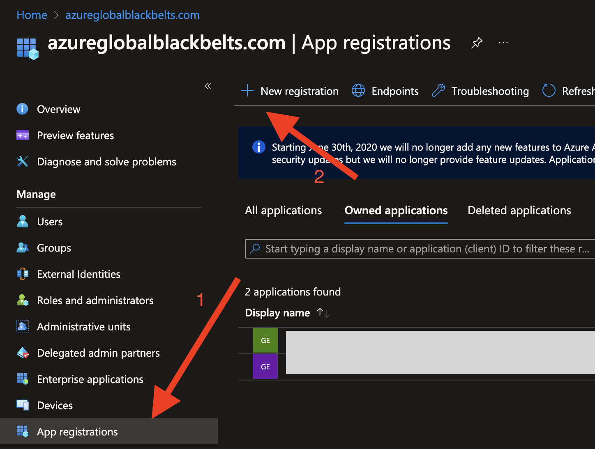
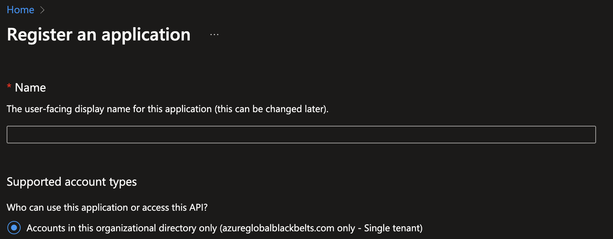
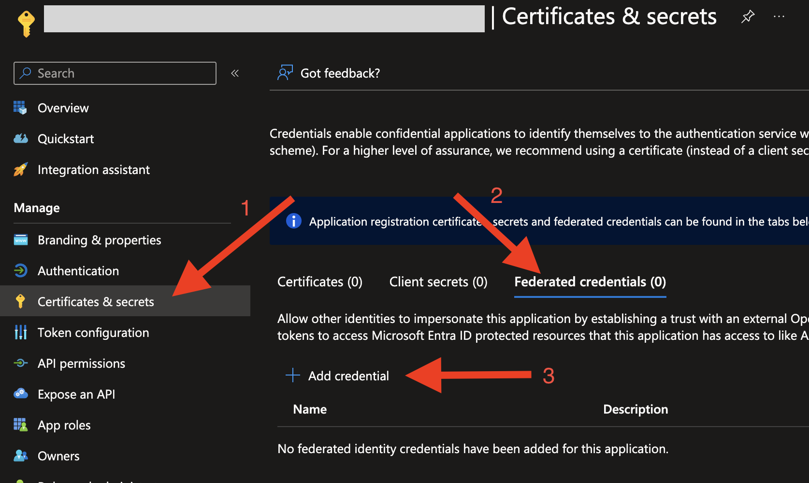
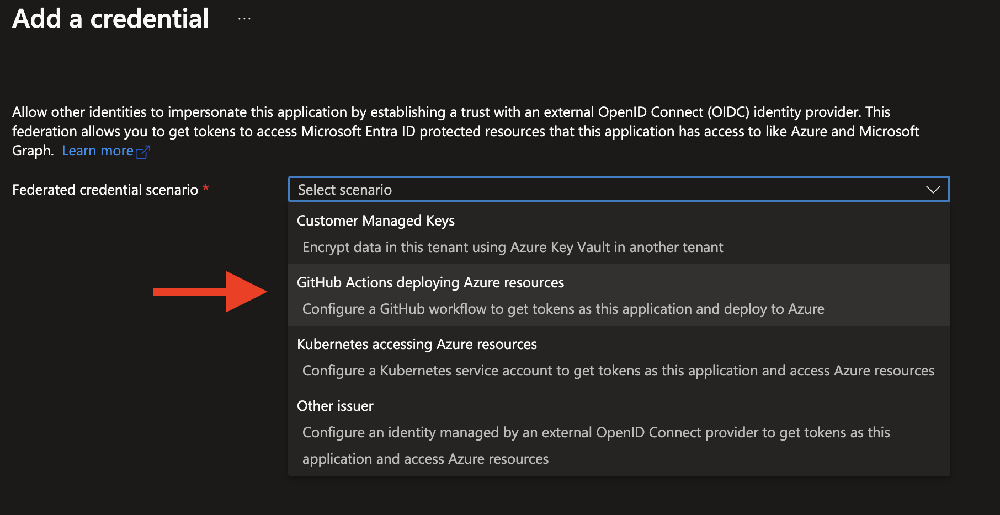
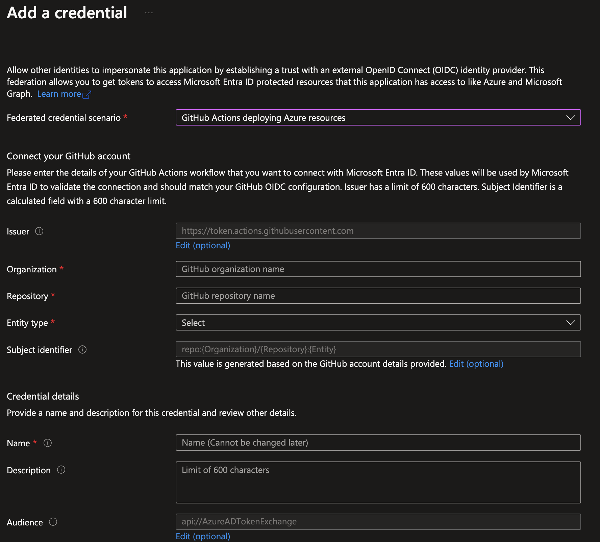
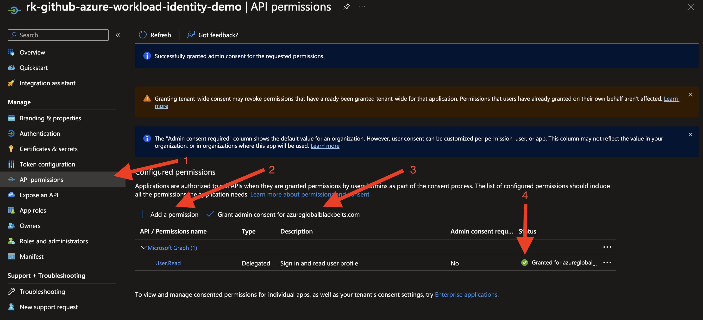
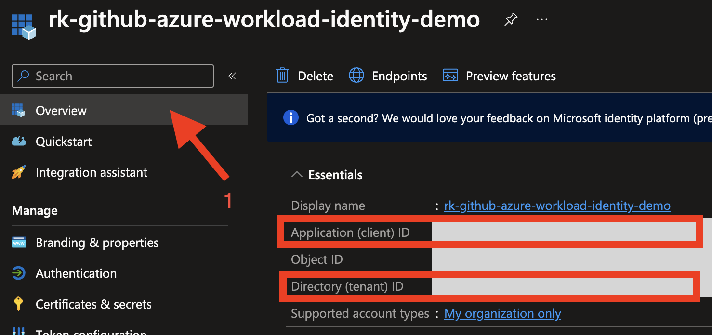
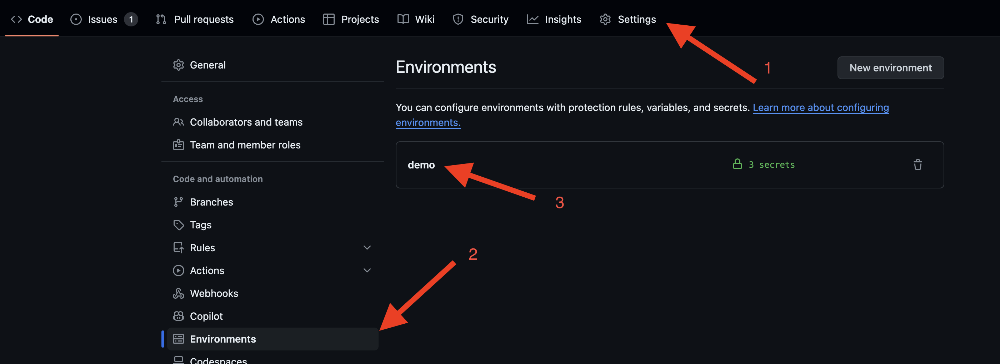
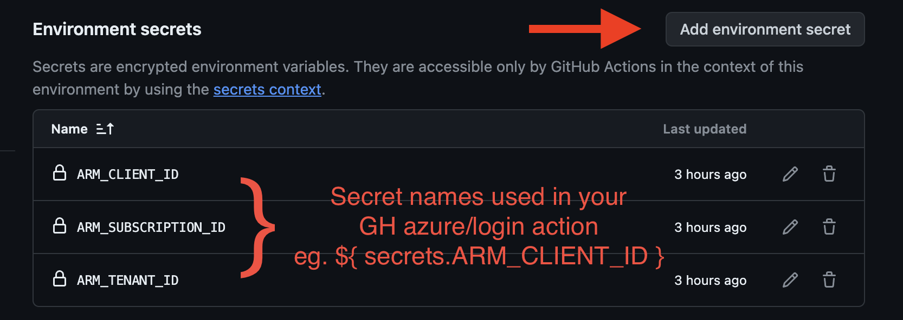

# GitHub to Azure OIDC Workload Identity
Testing GitHub to Azure OIDC Workload Identity.

## Plan out how you will use the federated identity
- Will you be using this identity with:
    - GitHub Repo Environments?
    - Pull Requests?
    - Tags?
    - Branches?
Each of these will trigger/present themselves as a different "entity type" and hence the identity tied to the federated workload identity will be scoped accoridngly.


> [!NOTE]
Currently this demo is set to only work with GitHub Action Environments.  As such the default Environment name will be "demo" unless otherwise specified via tfvars

## Scripted Bootstrapping with Terraform

```bash
#!/bin/bash

# log into Azure using your personal user account with admin rights
az login

# Needed if running in GH Codespaces as the token scope does not allow you to write GH Environment Secrets
# safe to unset even if you're not in codespaces
unset GITHUB_TOKEN

# log into GitHub
gh auth login

# Move to the terraform dir
cd bootstrapping/terraform/

# Terraform song and dance
terraform init
terraform plan -out tfplan
terraform apply tfplan
```

## Using this in GitHub Actions

See the example [GitHub Actions Workflow](.github/workflows/gh-workload-identity-demo.yaml)

## Manual Bootstrapping Tasks:

### Create a new Service Principal (App Registration) in Microsoft Entra (The artist formerly known as Active Directory)


### Name your Service Principal


### Create Federated Credential


### Choose GitHub Actions


### Configure Federated Credential


### Grant API Permissions


### Note Client (App) and Tenant IDs


### Save Client (App) and Tenant IDs as GitHub Actions Environment Secrets
You must save the Client (App) ID and the Microsoft Entra (Artist formerly known as Azure Active Directory) Tenant ID into GitHub Secrets for the specified and appropriate level/entity type (e.g. [Environment, Branch, Pull Request, Tag]) as specified in ```"Configure Federated Credential"``` above.

### Access GitHub Repo Environment Secrets


### Create GitHub Repo Environment Secrets

